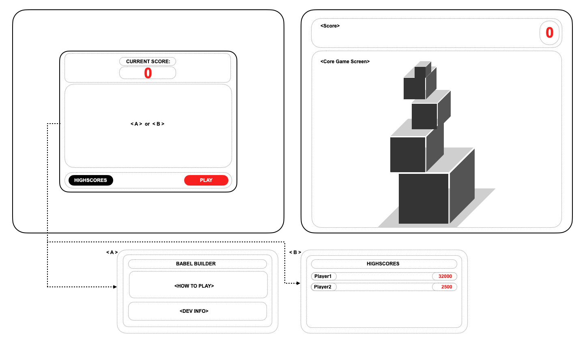

# BabelBuilder
Babel Builder is a tower building game where a user must time their placement of flying tower segments to ensure that their tower grows as tall as possible. If the player’s segment timing is off an overhang occurs and that part of the segment  crumbles making it progressively harder as the game progresses! 

### Live Site:
* [babelbuilder.com](http://www.babelbuilder.com/)

### Babel Builder Wireframe:

### BabelBuilder Wiki:
* [BabelBuilder Design Documents](https://github.com/colewendling/BabelBuilder/wiki)

### MVP List:
* [MVP List](https://github.com/colewendling/BabelBuilder/wiki/MVP-List)

### Technologies, Libraries, APIs:
* [Technologies, Libraries, APIs](https://github.com/colewendling/BabelBuilder/wiki/Technologies,-Libraries,-APIs)

### Backend:
* [Backend](https://github.com/colewendling/BabelBuilder/wiki/Backend)

### Implementation Timeline:
* [Implementation Timeline](https://github.com/colewendling/BabelBuilder/wiki/Implementation-Timeline)

